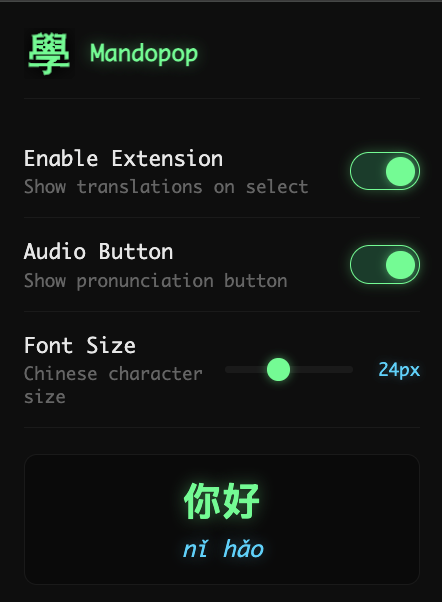

# 學 Mandopop

Chrome extension for learning Mandarin vocabulary while browsing. Select any English word to see Chinese characters with pinyin and pronunciation.

  
  
  

## Features

- **Instant translations** - Select English text → see Chinese + pinyin with tone marks
- **Audio pronunciation** - Click speaker button to hear native pronunciation (Taiwan Mandarin)
- **Offline dictionary** - 49,000+ words from CC-CEDICT, works without internet
- **Dark hacker theme** - Neon green/cyan aesthetic
- **Lightweight** - Dictionary loads once in service worker, shared across all tabs

## Install

1. Clone or download this repo
2. Open `chrome://extensions` in Chrome
3. Enable **Developer mode** (top right toggle)
4. Click **Load unpacked** → select the `mandopop` folder

## Usage

1. Navigate to any webpage
2. Select an English word (e.g., "hello")
3. Popup shows: **你好** *nǐ hǎo*
4. Click 🔊 to hear pronunciation
5. Press `Escape` or click outside to dismiss

## Settings

Click the extension icon to configure:
- Toggle extension on/off
- Show/hide audio button
- Adjust Chinese character font size

## Tech Stack

- **Platform**: Chrome Extension (Manifest V3)
- **Dictionary**: CC-CEDICT (bundled, ~17MB, cached in IndexedDB for fast service worker restarts)
- **Audio**: Web Speech API (prefers Meijia voice for Taiwan Mandarin)
- **Storage**: chrome.storage.sync for settings, IndexedDB for dictionary cache

## Project Structure

```
mandopop/
├── manifest.json      # Extension config (MV3)
├── background.js      # Service worker (ES module) - dictionary cache & lookups
├── content.js         # Selection detection & popup rendering (IIFE)
├── lib/
│   ├── normalize.js   # Word normalization & lookup logic (ESM)
│   └── pinyin.js      # Pinyin conversion & word extraction (ESM)
├── styles.css         # Neon hacker theme
├── popup.html/js      # Settings panel
├── cedict.json        # CC-CEDICT dictionary (preprocessed, ~17MB)
└── icons/             # Extension icons (學 character)
```

## Development

```bash
npm install && npm test && npm run lint:fix
```

**Regenerate dictionary** (if CC-CEDICT updates):
```bash
# Download latest CC-CEDICT
curl -o cedict.gz "https://www.mdbg.net/chinese/export/cedict/cedict_1_0_ts_utf-8_mdbg.txt.gz"
gunzip cedict.gz
mv cedict cedict_ts.u8

# Preprocess
node scripts/preprocess_cedict.cjs

# Cleanup
rm cedict_ts.u8
```

**Regenerate icons**:
```bash
bash scripts/generate_icons.sh
```

## Credits

- Dictionary: [CC-CEDICT](https://cc-cedict.org/) (CC BY-SA 4.0)
- Audio: macOS/Chrome Web Speech API
