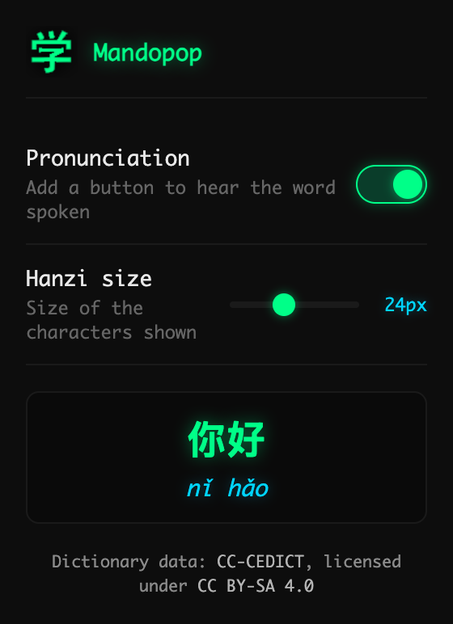

# 学 Mandopop

Chrome extension for learning Mandarin vocabulary while browsing. Select any English word/phrase for popup with Chinese characters, pinyin & pronunciation.

An experimental sideload-only Android version lives in [`android/`](android/README.md).

A personal project, public because there's no reason not to be. Both apps additionally offer an
optional [Traverse](https://traverse.link) integration that mirrors my own Mandarin Blueprint
spaced-repetition state — useful if you happen to use that course, inert if you don't. On Android
it lives in `android/app/src/main/java/com/mandopop/traverse/` and feeds a due-card notification;
in the extension it lives in `lib/traverse/` and feeds the **diglot weave** — English words I've
learned get swapped for their hanzi while I browse, pinyin and the original word on hover.
Signed out, neither client touches the network.

  
  

## Features

- **Instant translations** - Select English text → see Chinese + pinyin with tone marks
- **Audio pronunciation** - Click speaker button to hear native pronunciation (Taiwan Mandarin)
- **Offline dictionary** - 124,000 entries from CC-CEDICT, works without internet
- **Dark hacker theme** - Neon green/cyan aesthetic
- **Lightweight** - Dictionary loads once in service worker, shared across all tabs
- **Diglot weave** *(optional, needs Traverse sign-in)* - Replaces English words you've learned
  with their hanzi as you browse; hover for pinyin and the original word. Replacement decisions are
  made offline at sync time — page text never leaves the browser

## Install

1. Clone or download this repo
2. Open `chrome://extensions` in Chrome
3. Enable **Developer mode** (top right toggle)
4. Click **Load unpacked** → select the `mandopop` folder

## Usage

1. Navigate to any webpage
2. Select an English word (e.g., "hello")
3. Popup shows: **你好** *nǐ hǎo*
4. Click 🔊 to hear pronunciation
5. Press `Escape` or click outside to dismiss

## Settings

Click the extension icon to configure:
- Toggle extension on/off
- Show/hide audio button
- Adjust Chinese character font size
- Sign in to Traverse, watch sync coverage, and toggle the diglot weave

## Tech Stack

- **Platform**: Chrome Extension (Manifest V3)
- **Dictionary**: CC-CEDICT (bundled, ~13MB, cached in IndexedDB for fast service worker restarts)
- **Audio**: Web Speech API (prefers Meijia voice for Taiwan Mandarin)
- **Storage**: chrome.storage.sync for settings, IndexedDB for dictionary cache,
  chrome.storage.local for the Traverse mirror (schedules, card content, known words)

## Project Structure

```
mandopop/
├── manifest.json      # Extension config (MV3)
├── background.js      # Service worker (ES module) - dictionary cache & lookups
├── content.js         # Selection detection & popup rendering (IIFE)
├── content/
│   ├── cedict_formatter.js # No-build content-script formatter
│   └── diglot.js      # Page pass: swaps known English words for hanzi (IIFE)
├── scripts/
│   └── preprocess_cedict.js # CC-CEDICT → cedict.json
├── lib/
│   ├── normalize.js   # Word normalization & lookup logic (ESM)
│   ├── pinyin.js      # Pinyin conversion & word extraction (ESM)
│   ├── diglot.js      # Replacement table builder & text matcher (ESM)
│   └── traverse/      # Traverse client: auth, Firestore REST, sync, card parsing
├── testdata/          # Shared browser/Android parity fixtures
├── styles.css         # Neon hacker theme
├── popup.html/js      # Settings panel
├── cedict_ts.u8       # CC-CEDICT source (committed; input to preprocessing)
├── subtlex_ch.tsv     # SUBTLEX-CH word frequencies (ranking signal only, no definitions)
├── cedict.json        # CC-CEDICT dictionary (preprocessed, ~13MB, entries + English index)
├── dict_version.js    # Generated dictionary content hash (cache key)
├── android/           # Sideload-only Android app
└── icons/             # Extension icons (学 character)
```

## Development

```bash
npm install && npm test && npm run lint
```

Android build/test/install instructions are in [`android/README.md`](android/README.md).

**Rebuild dictionary** (both sources are committed, so this is reproducible offline):
```bash
npm run dict:build          # cedict_ts.u8 + subtlex_ch.tsv -> cedict.json + dict_version.js
```

Several Chinese entries usually qualify for a given English word. They are ordered by whether the
entry's *leading* sense is that word, then by frequency in
[SUBTLEX-CH](https://journals.plos.org/plosone/article?id=10.1371%2Fjournal.pone.0010729) (33.5M
words of film and TV subtitles). Subtitle frequency reflects everyday speech, where written corpora
overstate formal vocabulary — so "tired" resolves to 累, not the literary 困倦.

**Update to a newer CC-CEDICT release** (replaces the committed source):
```bash
curl -o cedict.gz "https://www.mdbg.net/chinese/export/cedict/cedict_1_0_ts_utf-8_mdbg.txt.gz"
gunzip cedict.gz && mv cedict cedict_ts.u8
npm run dict:build
# commit the updated cedict_ts.u8, cedict.json, and dict_version.js together
```

**Update the frequency table** (rarely needed; SUBTLEX-CH is a fixed 2010 dataset):
```bash
curl -sSL -o subtlex.zip "https://journals.plos.org/plosone/article/file?type=supplementary&id=info:doi/10.1371/journal.pone.0010729.s002"
unzip -o subtlex.zip SUBTLEX-CH-WF SUBTLEX-CH-CHR   # GBK-encoded, tab separated
iconv -f GBK -t UTF-8 SUBTLEX-CH-WF | tail -n +4 | cut -f1,3 > subtlex_ch.tsv
npm run dict:build
```

**Regenerate icons**:
```bash
bash scripts/generate_icons.sh
```

## Roadmap

The Android app knows which words I know: it reads my whole flashcard deck and keeps a
`known_words` index. On Android nothing consumes that index yet except a coverage readout in
settings (the browser's twin index feeds the diglot weave); the due-card notification reads the
cards directly. Next, roughly in order — each unlocks the one after:

- **SRS-aware lookups** — the selection overlay showing recall state ("reviewed 4×, due tomorrow").
- **Tap-anywhere reading mode** — read on-screen text from the accessibility tree instead of
  requiring a selection. Also the groundwork for the next item.
- **Progressive hanzi** — swap known English words for characters as I learn them. Shipped in the
  browser as the diglot weave, where the DOM permits real rewriting. Hard limit on Android: an
  accessibility service cannot rewrite another app's text, only draw over its bounding boxes, so
  this fights scrolling and reflow. One allowlisted app first.
- **Writing chip** — live-translate a sentence above the keyboard. Needs on-device NMT (ML Kit);
  independent of the others.

## License

MIT — see [LICENSE](LICENSE). The bundled dictionary and frequency data keeps its own terms;
CC-CEDICT is share-alike, so the generated `cedict.json` and SQLite asset are too.

## Credits

- Dictionary: [CC-CEDICT](https://cc-cedict.org/), CC BY-SA 4.0. `cedict.json` and the generated
  SQLite asset are derivative works and carry the same share-alike terms.
- Word frequencies: SUBTLEX-CH — Cai Q, Brysbaert M (2010),
  [*SUBTLEX-CH: Chinese Word and Character Frequencies Based on Film Subtitles*](https://journals.plos.org/plosone/article?id=10.1371%2Fjournal.pone.0010729),
  PLoS ONE 5(6): e10729, CC BY. `subtlex_ch.tsv` is that data trimmed to headword and
  occurrences per million.
- Audio: macOS/Chrome Web Speech API
- The Mandarin Blueprint and Traverse logos are trademarks of their respective owners, included
  only to identify the services the optional sync connects to. No affiliation or endorsement.
